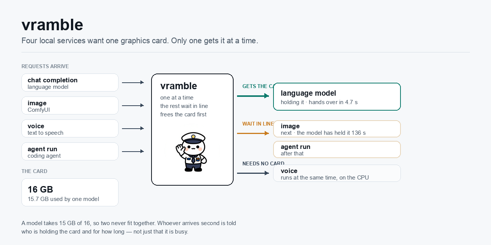

# vramble



A GPU arbiter for a single workstation: one lease at a time, a queue with priorities, and services
started and stopped on demand.

On one machine with one or two GPUs, several independent local services each need the whole card. A
27B model takes 15 GB of 16; ComfyUI wants the same 15 for an image; a text-to-speech, a music model
and a coding agent each want their share. None of them knows the others exist, so they evict each
other mid-job or fail with an out-of-memory error.

vramble sits between them. It grants **one lease at a time** and answers whoever arrives second with
the facts: which activity holds the machine, since when, and how long the lease is still valid.
Requests that cannot be served immediately are queued with a priority and an id that can be followed
or cancelled. The VRAM held by activities without the lease is released — and verified by measuring
it, because a service that reports a successful release without performing one is how two models end
up on the same card. Work that needs no GPU runs in a separate lane alongside the lease holder.

Services are declared in YAML: how to start them, how to make them release their VRAM, how long they
may stay idle. Callers request capabilities by name — `image`, `voice`, `llm` — and never see a
workflow file or a node id. An OpenAI-compatible endpoint puts existing clients through the same
queue without modification.

It is not a cluster scheduler. It is a mutex for one workstation, with priorities: about 2700 lines
of Python, no dependency beyond pyyaml, no database server, no broker, no container. It runs as a
systemd user unit on 127.0.0.1 and has been in daily use on one machine for months.

## What it does

- **One lease at a time.** With models taking 15-16 GB out of 16.3, two serious workloads never
  coexist. Whoever holds the machine keeps it; whoever arrives second is told *who* is holding it and
  *for how long*, not just "error".
- **Starts and stops the environments for you.** ComfyUI, an LLM server, a music server: vramble starts
  them when a request needs them, frees their VRAM when someone else needs the card, and shuts them
  down after an idle timeout.
- **A queue with ids.** Every request gets an id, waits its turn, and can be followed or cancelled.
  Priority per activity, plus aging so low-priority work is not starved forever.
- **A service catalog.** `image`, `voice`, `video`, `music`… each declared in YAML with
  its parameters. Callers ask by name; they never see workflow files or node ids.
- **An OpenAI-compatible proxy.** `POST /v1/chat/completions` goes through the same queue, so your
  chat client and your batch jobs cannot trample each other.

## Install

Python 3.11+ and `pyyaml`. Everything else is the standard library: no database server, no broker,
no container. A GPU is not needed to try it out — without `nvidia-smi` vramble arbitrates all the same,
it just cannot measure the VRAM.

```bash
bash install.sh         # first pass: writes ~/vramble/config.yaml and stops so you can read it
$EDITOR ~/vramble/config.yaml
bash install.sh         # second pass: installs, enables the systemd user unit, starts it
```

`VRAMBLE_NO_SERVICE=1 bash install.sh` installs the files and skips systemd (other init, or a try-out).
Then start it with `python3 ~/vramble/vramble.py`. `VRAMBLE_BIN` chooses where the two CLIs go.

Your `activities.yaml` and `services.yaml` start as copies of the `.example` files. They are your
configuration and stay out of git.

## Quick start

```bash
gpu-lease status                       # who holds the machine, VRAM, queue
gpu-job ask image --prompt "a lighthouse at dusk"   # service names come from your catalog
gpu-job list · gpu-job status <id> · gpu-job follow <id> · gpu-job cancel <id>
gpu-lease run research --ttl 43200 -- python train.py   # activity names come from activities.yaml
gpu-lease preempt "I need the machine"
```

A service that must not start unarbitrated (a model server, a generator) takes the lease with
`gpu-lease run llm --require-lease -- <command>`: if vramble is not answering it waits for it and then
refuses to start, instead of landing on a card somebody else is using. Without the flag the command
runs anyway — the arbiter must never be able to block a person working by hand.

## How a request flows

1. A client asks for a service (`POST /api/requests`) or takes a lease directly (`gpu-lease run`).
2. vramble checks the holder: free → granted; preemptible holder → it is drained; a holder that cannot
   yield → **409 with who is there, since when, and how long this service is willing to wait**.
3. The environment is started if needed, the job runs, the lease is released, and after the idle
   timeout the VRAM is freed.

## Who is allowed to ask

vramble listens on `127.0.0.1` only, and refuses any POST that carries an `Origin` or `Referer` header,
so a web page open in your browser cannot enqueue work. Beyond that, **the default is that anything
able to reach the port can queue catalog jobs and take or preempt the lease** — on a single-user
workstation that is the point; on a shared machine it means every other account on it.

Two knobs, both empty by default:

- `token` — when set, **every** POST must carry it in `X-Vramble`.
- `submit_token` — gates `POST /api/jobs`, the one endpoint that runs an `argv` chosen by the caller.
  **Empty means closed**, not open: that route answers 403 until you configure a token for it.

Service commands themselves always come from your YAML, never from the request: a caller picks a
service by name and fills its declared parameters, and the argv is executed without a shell.

## Configuration — nothing machine-specific in the code

`config.yaml` (see `config.example.yaml`) holds paths, port, listen address, token, endpoints and
limits; every entry can be overridden by an environment variable. Registry commands use the
placeholders `{swap_url}`, `{comfy_url}`, `{acestep_url}`, `{base}`, so pointing vramble at Ollama, at a
different ComfyUI or at another host is configuration, not a patch.

`activities.yaml` describes *who can hold the machine*: priority, whether it is preemptible, how much
VRAM it needs, how to drain it, how to start it, how long it may idle.
`services.yaml` describes *what can be asked for*: the command, the parameters, the limits. Service
and parameter names are yours — they are data, and they can be in any language.

## Adding a service

This is the thing you will do most often. A service is a name, a command, and how the parameters
map onto it — vramble never knows what a workflow or a node id is.

```yaml
services:
  image:
    description: 'Z-Image Turbo: photoreal and faces, the fastest one'
    time_hint: 2.5 s (6 s the first time)
    activity: comfy                  # which activity holds the card while this runs
    command: ['{PY_COMFY}', '{T}/run_prompt.py', '{T}/wf/zimage.json']
    required: [prompt]               # refused, with the list, if missing
    set:                             # parameter -> node.input of the ComfyUI workflow
      prompt: 27.text
      seed: 3.seed
      width: 13.width
    limits: {width: [256, 2048]}     # out of range is a 400, not a broken render
```

Then `gpu-job ask image --prompt "a lighthouse at dusk"`, or `POST /api/requests
{"service": "image", "prompt": "…"}`. For a service that is a plain script, use `flags` instead of
`set`: `flags: {text: --text, engine: --engine}` turns `--text "hello"` into that script's own option.

`activity_if` sends a request elsewhere depending on a parameter — this is how a CPU-only voice
model stops taking a GPU turn:

```yaml
    activity_if:
      engine: {kokoro: cpu}
```

`python3 check_catalog.py` validates the catalog against the workflows and refuses unknown keys or
activities that do not exist; vramble runs it at startup and logs the result.

## Declaring an activity

An activity is *who can hold the machine*. The two that matter are how it gives the VRAM back and
how it comes up:

```yaml
activities:
  llm:
    match: llama-server|vllm         # how to recognise its processes on the card
    priority: 50
    preemptible: true                # can yield without losing work
    vram_gb: 15.7                    # >= whole_card_threshold_gb means it wants the card alone
    default_wait: 90                 # how long a request for it queues before giving up
    default_ttl: 3600
    idle_ttl: 1800                   # freed automatically after this long doing nothing
    drain_soft: curl -s -m 60 -X POST {swap_url}/api/models/unload
    drain_hard: curl -s -m 60 -X POST {swap_url}/api/models/unload
    healthcheck: curl -sf -m 3 {swap_url}/v1/models
```

A service that must never start unarbitrated takes the lease itself:
`gpu-lease run llm --require-lease -- llama-server …`.

## Who decides the priority

The registry does. Each activity declares its own `priority`, and that is what a request gets.

A caller may ask for a **lower** one — `X-Prio: 20` on the proxy, `"prio": 20` in a request — and
that is honoured: it is how background work yields to a person. Asking for a *higher* one is
ignored, and quietly: otherwise anyone able to reach the port could declare priority 999, walk past
the queue, and make a preemptible holder yield to them. Only `POST /api/jobs`, which already
requires its own token, may raise.

Within the same priority, first come first served — and a job waiting gains one point a minute, up
to more than the widest gap in your registry, so the lowest-priority work eventually goes through
instead of waiting forever behind a stream of urgent requests.

## When something does not give the card back

- `gpu-lease status` says who holds it, since when, and how long the lease is still valid.
  `GET /status` adds `vram_by_activity`: how much VRAM each activity is actually holding.
- A drain that frees nothing is reported as such (`nothing freed`), not as success — if you see it,
  the service is probably busy rather than idle. ComfyUI, for one, answers 200 to `/free` while a
  prompt is running and frees nothing until that prompt ends.
- `gpu-lease preempt "reason"` takes the machine from a preemptible holder. One that declares no way
  to free its VRAM answers 409 and tells you so: stop it by hand, and the lease frees itself.
- `gpu-lease free` empties the cards without touching the lease holder.
- The log says what it did and how long it took: `drain comfy (hard): ok, freed 13122 MiB [1.7s]`.

## Where it has run

Developed and used daily on one machine (Linux, 2× RTX 5070 Ti). The test suite and a
**from-scratch install** — `install.sh`, start, `/status`, a lease — run in CI on Linux at every
push, and the same install has been done by hand on macOS, where there is neither systemd nor an
NVIDIA card. So: one machine in production, three where it is known to come up. If you run it
somewhere else and it breaks, that is worth an issue.

## Tests

```bash
python3 tests/all.py        # 78 tests, ~110 s, no GPU and no network needed
```

Registry, catalog and database are temporary; service commands are `true`/`echo`, so the tests
measure the logic — who holds the slot, who waits, who yields — not the hardware.

Writing them surfaced four defects that were live at the time: a reentrant lease handed out the
owner's token, so the first release dissolved everybody's; the aging cap was smaller than the widest
priority gap in the registry, so low-priority work could never overtake; job ids restarted after a
prune, so one id could name two different jobs; and placeholder expansion used `str.format`, which
destroyed any command containing JSON braces — including a drain command, which then failed
silently and left two models on the same card.

## One machine, one lease

The lease is global: whoever holds it holds *the machine*, not a card. With two 16 GB cards and
models that take 15-16 GB each, per-GPU leases would buy you the case where a 6 GB voice model and a
15.7 GB LLM sit on separate cards — and would cost the property that makes this thing predictable:
one holder, one queue, one answer to the question of who has it. The trade was made deliberately in
favour of the simpler model. `vram_gb` per activity still matters: it decides whether a request wants the whole card (drain
everything, leftovers included) or can live beside what is already there.

If your models are small enough to genuinely coexist, this is the wrong tool — a VRAM budget broker
would serve you better.

## Things worth knowing

- **Drain and start happen outside the daemon lock.** Holding it made a dying process unable to call
  `/release`, so its launcher killed it at timeout: 30 s per switch instead of 0.2 s.
- **A subprocess is not a new request.** The model loaded *inside* an agent run is declared compatible
  and goes through; a new request from the queue waits. That is the `internal` flag.
- **When the owner leaves but its model is still loaded**, the lease degrades to that activity, which
  is preemptible: the machine does not stay "the agent's" for half an hour.
- **Cancelling stops the work inside the service too** (`interrupt` in the registry): killing the
  client would leave the prompt in ComfyUI's own queue, still burning the GPU.
- **The lease survives a restart of the daemon.** It is kept in the same database as the jobs and,
  at startup, only restored if the machine agrees: the activity must still be holding VRAM. A holder
  that died with the daemon does not come back to haunt the card.
- **A drain that frees nothing does not report success.** ComfyUI answers 200 to `/free` while a
  prompt is running and frees nothing; the VRAM is measured before and after, and an activity that
  freed nothing is left alone for a minute instead of being drained on every tick.
- **Who asked is taken from the kernel**, not from the request, whenever the caller comes through the
  unix socket: `SO_PEERCRED` cannot be forged. The TCP port stays for the proxy and for clients on
  another machine, where the caller says who it is.
- Measured on the reference machine (2× RTX 5070 Ti, no NVLink): LLM → image handover **4.7 s**;
  loaded LLM → delivered image **11.2 s**, or **6.9 s** if the image service is kept alive; proxy
  overhead on a free machine **0.37 s**.

## License

MIT — see `LICENSE`.
